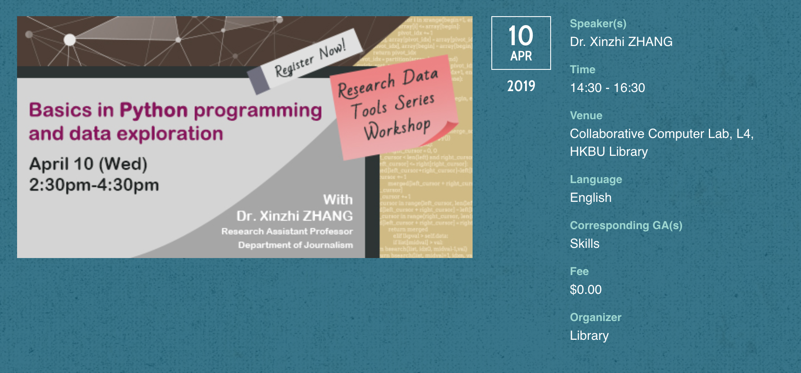

## Hong Kong Baptist University Library Research Tools Workshop Series 2019
*Basic Python programming for data exploration*

This repository stores the slides and code examples for a mini workshop on *Basic Python programming for data exploration* [Event webpage](https://sa.hkbu.edu.hk/ccl/event/CCL18190605) held at HKBU Library, 10 April 2019.

## About the workshop
This 2-hour lightening workshop makes a whirlwind tour of basics in Python programming. It also introduces several Python data analytics packages such as Pandas and Matplotlib, and their application in preliminary data exploration and visualization. Workshop participants are required to bring with their own laptops for installation and hands-on exercises. Topics include package installation, program execution, as well as data processing, and what this workshop tries to convey as **"problem-driven data visualization and data-driven exploration."**

## Agenda ##
1. Python and its involvement with data science
2. Data processing
 - from raw data to consistent data
3. Data exploration (EDA)
 - Importing and knowing your data
      1. [Pandas](https://pandas.pydata.org/), [Matplotlib](https://matplotlib.org/), and [Seaborn](https://seaborn.pydata.org/)
      2. Getting the attributes of the your data
      3. Case selection
      4. Basic statistics
      5. Pivot table
 - Data exploration: exploring the data by visualization
      1. Univariate (unidimensional) and bivariate (two-way) data visualization
      2. Multivariate (multidimensional) problem-driven data visualization and data-driven exploration
4. Python: a baby step

## Documents
1. The [Slide](20190410_Library2019_slide.pptx)
2. The [Notebook for data processing]()
3. The [Notebook for data exploration]()

## About the facilitator
Dr Xinzhi ZHANG (M.A. & Ph.D., City University of Hong Kong) is a Research Assistant Professor at [JOUR](http://www.jour.hkbu.edu.hk/faculty-member/dr-xinzhi-zhang/). His research interests include comparative political communication, emerging technologies and social change, digital humanities, and data-driven journalism. His research works have been published on journals such as *Computers in Human Behavior*, *International Political Science Review*, and *Digital Journalism*. He teaches several interdisciplinary courses such as ***Social Media Data Acquisition and Processing with Python*** ([Course Repo](https://github.com/xzzhang2/201819A_cityu_com5507)), ***AI for Digital Communication***, and ***Algorithmic Culture***. He is the Director of the *[Data and Media Communication Concentration](http://bu-dmc.hkbu.edu.hk/)* at JOUR, and the Director of *[Master Science in AI and Digital Media](http://comd.hkbu.edu.hk/masters/en/aidm)*

## Acknowledgement  
The codes in this notebook are modified from various sources, including the official tutorial and tutorial 01. Miss He Can and Mr Xu Chen, both from the Department of Computer Science at Hong Kong Baptist University, helped to fine tune and test the codes. All codes are for educational purposes only and released under the MIT licence.
